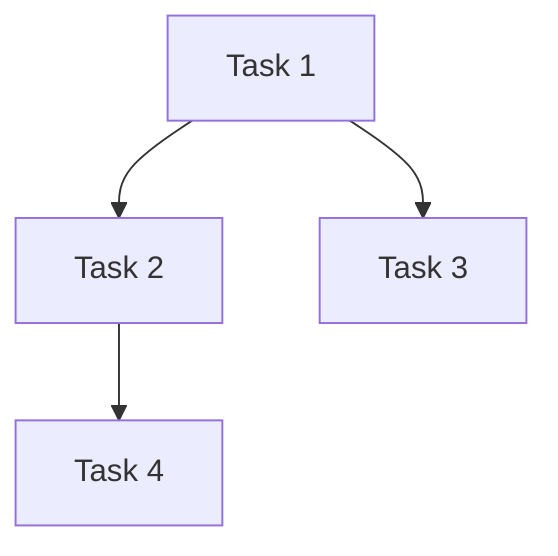

# Generate Implementation PRP

Generate a Project Requirements Plan (PRP) with detailed implementation tasks from an INITIAL.md file. Focus on concrete code changes without timeline estimates.

## Input

INITIAL.md file path: $1

## Instructions

1. **Read the INITIAL.md file** at the provided path

2. **Analyze the requirements** and identify:
   - All features/components to implement
   - Backend code changes needed (files, functions, models)
   - Frontend code changes needed (components, stores, routes)
   - Dependencies between tasks
   - Testing requirements

3. **Generate a PRP document** with the following structure:

### PRP Structure

```markdown
# PRP: [Project Name]

## Executive Summary
Brief overview of what will be implemented.

## Implementation Tasks

### Phase 1: [Phase Name]

#### Task 1.1: [Task Name]
**Files to modify:**
- `path/to/file.py` - Description of changes

**Implementation steps:**
1. Step one
2. Step two
3. Step three

**Acceptance criteria:**
- [ ] Criterion 1
- [ ] Criterion 2

#### Task 1.2: [Next Task]
...

### Phase 2: [Phase Name]
...

## File Change Summary

| File | Action | Description |
|------|--------|-------------|
| path/to/file.py | MODIFY | Add new function |
| path/to/new.py | CREATE | New module |

## Dependencies



## Testing Plan

### Unit Tests
- Test case 1
- Test case 2

### Integration Tests
- Test scenario 1
- Test scenario 2

## Rollback Plan
Steps to revert changes if needed.
```

4. **Save the PRP** to `PRPs/PRP_[project-name].md`

5. **Report** the PRP file location and summary of tasks

## Output

- Generated PRP file path
- Count of tasks by phase
- List of files to be modified/created

## Notes

- Focus on implementation details, not timelines
- Each task should be atomic and independently testable
- Include specific file paths and function names where known
- Use the codebase exploration tools if needed to identify exact locations
